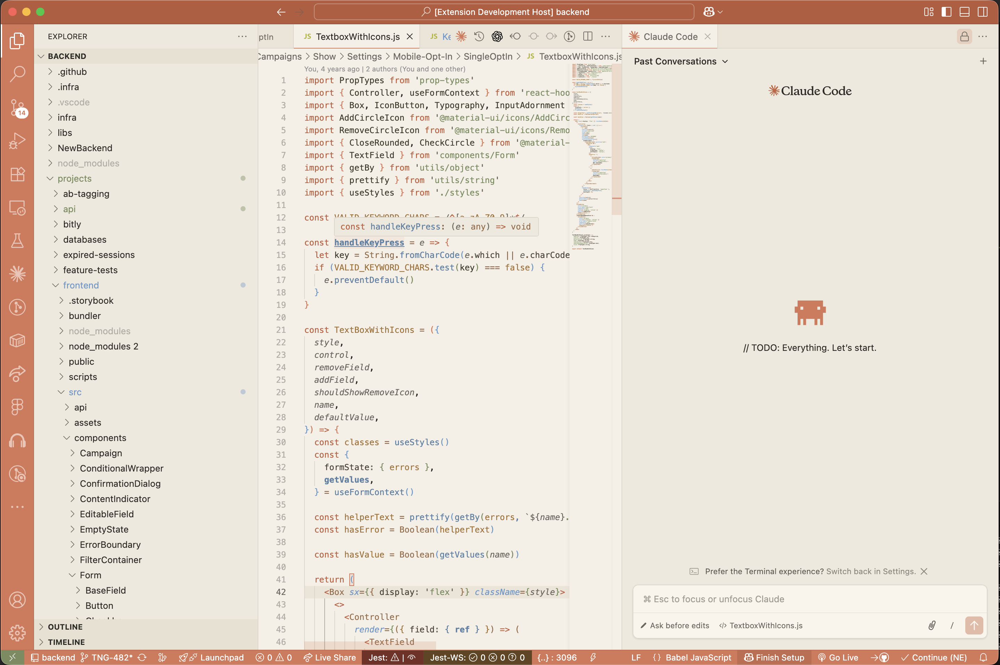
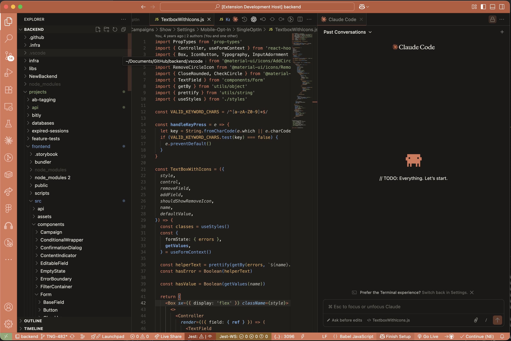
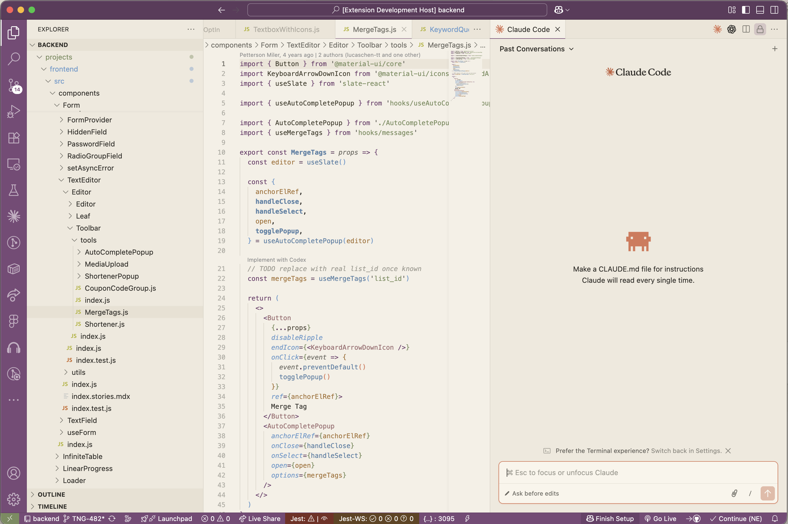
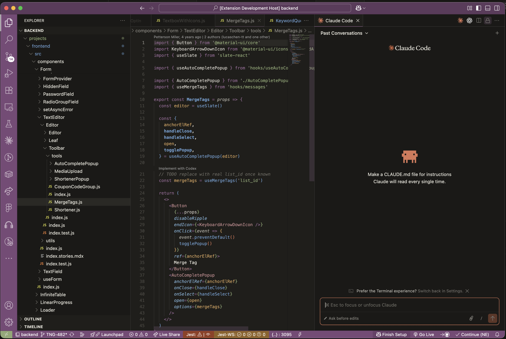

# 🎨 Claude Mode

### A warm, elegant VS Code theme inspired by Claude AI

[](https://marketplace.visualstudio.com/items?itemName=TheWebDev.claude-mode)
[](https://marketplace.visualstudio.com/items?itemName=TheWebDev.claude-mode)
[](https://marketplace.visualstudio.com/items?itemName=TheWebDev.claude-mode&ssr=false#review-details)
[](https://github.com/stevie2codes/claude-mode/blob/main/LICENSE)

---

**Claude Mode** brings the warmth and sophistication of Claude AI's design language to your editor. Featuring creamy cream backgrounds, rich terracotta and plum accents, sage green strings, and soft blue functions — all wrapped in a carefully crafted "picture frame" UI.

> 🟠 **Claude Mode** — Terracotta accent · Light & Dark
> 🟣 **Claude Velvet** — Plum accent · Light & Dark

---

## ✨ 4 Themes Included

### 🟠 Claude Mode Light
Warm cream (`#f5f0e6`) editor background with terracotta frame effect.



### 🟠 Claude Mode Dark
Deep warm darks (`#1f1e1b`) with the same terracotta frame.



### 🟣 Claude Velvet Light
Warm cream background with a luxurious plum (`#7a4a78`) frame effect.



### 🟣 Claude Velvet Dark
Deep warm darks with plum accents throughout.



---

## 🎯 Design Philosophy

Claude Mode isn't just a color swap — every element is intentionally designed:

- **"Picture Frame" UI** — Title bar, activity bar, and status bar create a cohesive colored frame around your editor
- **Visual Hierarchy** — Darker title bar (`#b85a3a`) graduates to the primary accent below
- **Warm Typography** — Syntax colors drawn from Claude's brand palette, expanded with harmonious earth tones
- **Tinted Details** — Scrollbars, inlay hints, ghost text, and debug toolbars all carry the theme's warmth

---

## 🎨 Color Palette

### Claude Mode (Terracotta)
| Role | Light | Dark |
|------|-------|------|
| **Keywords** | `#c15f3c` | `#d97757` |
| **Strings** | `#788c5d` | `#8fa874` |
| **Functions** | `#5a82a6` | `#6a9bcc` |
| **Types** | `#9b6e4a` | `#c9956b` |
| **Constants** | `#a67235` | `#d4a05a` |
| **Comments** | `#a09d93` | `#6b6961` |

### Claude Velvet (Plum)
| Role | Light | Dark |
|------|-------|------|
| **Keywords** | `#6b3a69` | `#9a6a98` |
| **Strings** | `#788c5d` | `#8fa874` |
| **Functions** | `#5a82a6` | `#6a9bcc` |
| **Types** | `#9b6a6e` | `#c48a8e` |
| **Constants** | `#a67235` | `#d4a05a` |
| **Comments** | `#a09d93` | `#6b6961` |

---

## 📦 Installation

1. Open **VS Code**
2. Go to **Extensions** (`Ctrl+Shift+X` / `Cmd+Shift+X`)
3. Search for **"Claude Mode"**
4. Click **Install**
5. Open Command Palette (`Ctrl+Shift+P` / `Cmd+Shift+P`)
6. Type **"Color Theme"** → select **Preferences: Color Theme**
7. Choose your variant:
   - 🟠 Claude Mode Light
   - 🟠 Claude Mode Dark
   - 🟣 Claude Velvet Light
   - 🟣 Claude Velvet Dark

---

## 🛠 Features

- **Full workbench theming** — Sidebar, tabs, status bar, panels, terminal
- **Picture frame UI** — Colored title bar + activity bar + status bar
- **Tinted scrollbars** — Subtle accent-colored scrollbar indicators
- **Styled command center** — Frosted glass effect on the title bar
- **Debug toolbar** — Themed debug controls with action-colored icons
- **Notebook support** — Jupyter/notebook cell styling
- **Testing UI** — Sage green pass, red fail, amber queued indicators
- **Inlay hints** — Warm muted tones that don't distract
- **Ghost text** — Subtle warm gray for AI suggestions
- **Semantic highlighting** — Enhanced TypeScript/JavaScript token colors
- **Bracket pair colorization** — Using the brand accent palette
- **Git decorations** — Warm-toned status colors
- **Diff editor** — Themed insert/delete backgrounds
- **Terminal ANSI colors** — Full warm palette

---

## 🌐 Languages Tested

TypeScript · JavaScript · Python · HTML · CSS · JSON · YAML · TOML · Markdown · Rust · Go · Java · C++ · and more

---

## 💡 Recommended Settings

For the best experience, add these to your `settings.json`:

```json
{
  "editor.bracketPairColorization.enabled": true,
  "editor.guides.bracketPairs": "active",
  "editor.semanticHighlighting.enabled": true,
  "editor.fontFamily": "'JetBrains Mono', 'Fira Code', Menlo, monospace",
  "editor.fontLigatures": true
}
```

---

## 🤝 Contributing

Found a color that feels off? Want to suggest improvements?

1. [Open an issue](https://github.com/stevie2codes/claude-mode/issues) on GitHub
2. Fork the repo and submit a PR
3. Use **Developer: Inspect Editor Tokens and Scopes** to identify token scopes

---

## 📝 Changelog

See [CHANGELOG.md](CHANGELOG.md) for release history.

---

## 📄 License

[MIT](LICENSE) — Made with ☕ and warm earth tones.
